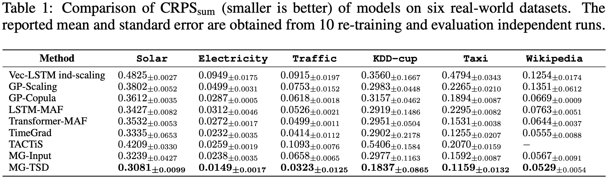
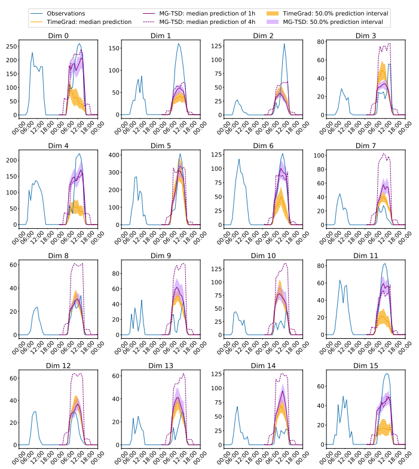
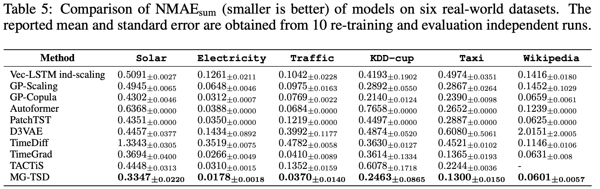

# MG-TSD 
MG-TSD: Multi-Granularity Time Series Diffusion Models with Guided Learning Process

Diffusion probabilistic models have the capacity to generate high-fidelity samples for generative time series forecasting; however, they also present issues of instability due to their stochastic nature. In order to tackle this challenge, we present a novel approach called [Multi-Granularity Time Series Diffusion (MG-TSD)](https://openreview.net/forum?id=CZiY6OLktd), which capitalizes on the intrinsic granularity levels present in the data, utilizing them as predefined targets at various stages of the diffusion process. These targets are used to guide the learning trajectory of the diffusion models, ensuring a more stable and accurate forecast.

In the field of long-term forecasting, the Multi-Granularity Time Series Diffusion (MG-TSD) model has established a new state-of-the-art, showcasing a notable relative improvement that spans from 4.7% to 35.8% across six benchmarks.

## Main Idea

We observe that the forward process of the diffusion model, which sequentially corrupts the data distribution to a standard normal distribution, intuitively aligns with the process of smoothing fine-grained data into a coarser-grained representation, both of which result in a gradual loss of finer distribution features.
This provides the insights that intrinsic features within data granularities may also serve as a source of guidance.

<p align="center">  
  
<br/>
Figure1: The process of smoothing data from
finest-grained to coarsest-grained naturally aligns
with the diffusion process
</p>  


In this paper, we propose a novel **M**ulti-**G**ranularity **T**ime **S**eries **D**iffusion (MG-TSD) model that leverages multiple granularity levels within data to guide the learning process of diffusion models. The coarse-grained data at different granularity levels are utilized as targets to guide the learning of the denoising process. These targets serve as constraints for the intermediate latent states, ensuring a regularized sampling path that preserves the trends and patterns within the coarse-grained data. They introduce inductive bias which promotes the generation of coarser features during intermediate steps and facilitates the recovery of finer features in subsequent diffusion steps. Consequently, this design reduces variability and results in high-quality predictions.

<p align="center">  
  
<br/>
Figure2: Overview of the Multi-Granularity Time Series Diffusion (MG-TSD) model
</p>  


## Quick start
```
conda create -n mgtsd python=3.9.12
conda activate mgtsd
pip install -r requirements.txt
bash scripts/run_mgtsd.sh
```
## A Simple Example
see `src/example.ipynb` for more information.

## Data
Run the `scripts/run_mgtsd.sh` and the data will be automatically downloaded to `~/.mxnet/gluon-ts/`.


## Result

Our comprehensive evaluation across six benchmarks and three performance metrics involved a comparison with nine baseline models. The results demonstrate that our model secures the state-of-the-art (SOTA) status, achieving a substantial improvement ranging from 4.7% to 35.8% on the $\text{CRPS}_{\text{sum}}$ metric across the six benchmarks.










## Citation
If you find this repo useful, please cite our paper.
```
@inproceedings{
fan2024mgtsd,
title={{MG}-{TSD}: Multi-Granularity Time Series Diffusion Models with Guided Learning Process},
author={Xinyao Fan and Yueying Wu and Chang Xu and Yuhao Huang and Weiqing Liu and Jiang Bian},
booktitle={The Twelfth International Conference on Learning Representations},
year={2024},
url={https://openreview.net/forum?id=CZiY6OLktd}
}
```


